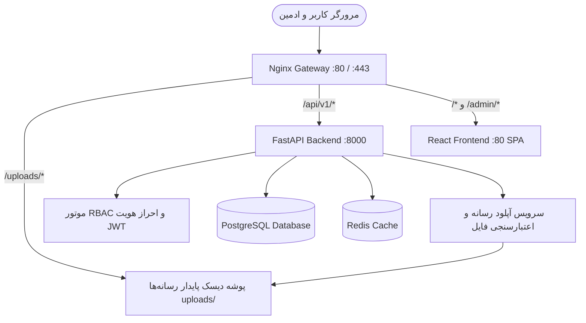

# گزارش جامع ممیزی پروژه، تحلیل بدهی‌های فنی و نقشه راه پنل مدیریت
## RAALLY.IR — Master Project Audit & Architecture Roadmap

این سند گزارش رسمی ممیزی فنی و ساختاری پلتفرم **Raally.ir** است که بر اساس بررسی مستقیم و عمیق کل مخزن، پایگاه داده، کانتینرها، مدل‌ها و کامپوننت‌ها تهیه شده است.

---

## ۱. معماری و استک فنی واقعی (Current Architecture)

بر اساس بررسی فایل‌های پروژه، استک واقعی سامانه به شرح زیر است:

- **بخش فرانت‌اند (Frontend):**
  - فریم‌ورک: React 18 با TypeScript و Vite 5
  - استایل‌دهی: Tailwind CSS سفارشی (بدون وابستگی به کتابخانه‌های سنگین خارجی)، فونت‌های محلی وزیرمتن در `public/fonts/`
  - مدیریت آیکون‌ها: Lucide React
  - انیمیشن‌ها: Framer Motion
  - وب‌سرور داخلی فرانت‌اند: Nginx Alpine (سروکننده باندل SPA خروجی `dist`)
- **بخش بک‌اند (Backend API):**
  - فریم‌ورک: FastAPI (Python 3.11)
  - پایگاه داده: PostgreSQL 16 (با درایور ناهمگام `asyncpg` و ORM اس‌کیو‌ال‌آلکمی `SQLAlchemy 2.0`)
  - کش و صف ناهمگام: Redis 7
  - سرور برنامه: Uvicorn با ۲ ورکر و مدیریت هم‌روندی ۲۰۰۰ اتصال
- **لایه دروازه و امنیت (Gateway & Reverse Proxy):**
  - دروازه اصلی: Nginx Gateway روی پورت‌های ۸۰ و ۴۴۳
  - هدایت ترافیک: ارجاع `/api/v1/*` به بک‌اند و سایر مسیرها به فرانت‌اند
  - ریت‌لیمیت: نرخ ۶۰ درخواست بر ثانیه برای API و ۵ درخواست بر دقیقه برای OTP
- **استقرار و زیرساخت (DevOps & Hosting):**
  - مجازی‌سازی: Docker Compose با ۵ کانتینر ایزوله (`rally_postgres`, `rally_redis`, `rally_backend`, `rally_frontend`, `rally_gateway`)
  - سرور: VPS اوبونتو ۲۲.۰۴ با ۴ گیگابایت رم، ۲ گیگابایت Swap و ۴۶ گیگابایت SSD
  - شبکه و DNS: ابر آروان (ArvanCloud Anycast)

---

## ۲. ماژول‌های فعال و پیاده‌سازی‌شده در سامانه (Functional Modules)

1. **رزرواسیون بلادرنگ کورت‌ها (Court Booking Engine):** قفل موقت اتمیک ۱۰ دقیقه‌ای (Atomic Hold)، الگوریتم جلوگیری از رزرو همزمان (Double Booking Prevention)، لغو طبق قوانین ۲۴ ساعته و استرداد کیف پول.
2. **کلوپ‌ها و باشگاه‌های پدل (Venues & Courts):** ثبت و مدیریت اطلاعات باشگاه‌ها، کورت‌های سرپوشیده و روباز، فیلتر شهری، موقعیت مکانی.
3. **کیف پول و تسویه حساب (Wallet & Settlement):** شارژ کیف پول، پرداخت با یک کلیک، ثبت رکوردهای تسویه با باشگاه‌ها (پایا).
4. **مچ‌میکینگ و هم‌بازی‌یابی (Matchmaking 4-Player):** لابی بازی ۴ نفره پدل بر اساس سطح، رزرو کورت مشترک و تسهیم خودکار هزینه بین ۴ بازیکن.
5. **مربیان و جلسات آموزشی (Coaches & Training):** پروفایل مربیان، بیوگرافی، مدارک، شاگردان و رزرواسیون ساعت آموزشی.
6. **فروشگاه تجهیزات پدل (Shop & E-Commerce):** کاتالوگ راکت‌های ۲۰۲۶ (ناکس، بول‌پدل، بابولات)، گالری رسمی تصاویر، مشخصات فنی، سبد خرید، محاسبه کوپن تخفیف.
7. **اخبار و مجله تخصصی (Magazine & News):** مقالات آموزشی، تحلیل ضربات (باندخا)، رویدادها، اخبار اردوی تیم ملی و تورهای جهانی.
8. **مسابقات و تورنمنت‌ها (Tournaments & Cups):** مسابقات کینگ آف کورت، آدینه رولو، لیگ مل و موج.
9. **رنکینگ رسمی بازیکنان (Rankings):** رده‌بندی کشوری ایران و جهان (FIP / Premier Padel) همراه با سکوی برترین‌ها.
10. **سیستم SOS و هشدارهای اضطراری (Incident Management):** ثبت لاگ رخدادهای بحرانی و لغو اضطراری بازی با عودت ۱۰۰٪ وجه.

---

## ۳. مشکلات ساختاری، فایل‌های اضافه و بدهی‌های فنی (Technical Debt & Clutter)

در بازرسی دقیق سورس‌کد، موارد زیر به عنوان بدهی‌های فنی و فایل‌های نامطلوب شناسایی شدند:

### الف) فایل‌های تکراری و تداخل همگام‌سازی گوگل‌درایو (` (1)`)
به دلیل همگام‌سازی میان چند سیستم، فایل‌های تکراری با پسوند ` (1)` در پروژه ایجاد شده‌اند که باعث سردرگمی، حجم اضافه و خطای تست‌ها می‌شوند:
- `backend/app/models/admin (1).py`
- `backend/app/models/matchmaking (1).py`
- `backend/app/api/v1/admin (1).py`
- `backend/app/api/v1/matchmaking (1).py`
- `backend/app/services/admin_service (1).py`
- `backend/app/services/matchmaking_service (1).py`
- `backend/tests/unit/test_admin_api (1).py`
- `backend/tests/unit/test_admin_service (1).py`
- `backend/tests/unit/test_matchmaking_and_court_management (1).py`
- `backend/tests/unit/test_matchmaking_api (1).py`
- `backend/uv (1).lock`

### ب) پایگاه‌های داده موقت و تستی در ریشه مخزن
فایل‌های متعدد دیتابیس SQLite ناشی از تست‌های قبلی در پوشه اصلی رسوب کرده‌اند:
- ۱۱ فایل با الگوی `test_*.db` (مانند `test_15c03286.db`, `test_2f81d67d.db`, ...) با حجم مجموع بیش از ۳ مگابایت.
- فایل `padel.db` در ریشه و `backend/test_7070bbd8.db`.
- فایل‌های عکس آزمایشی مانند `temp_inspect_kotc.png`، `temp_kotc_remote.jpg`، `temp_kotc_vps.jpg`.

### ج) تصاویر بسیار سنگین در پوشه عمومی فرانت‌اند
- تصویر `frontend/public/images/real_padel_hero.jpg` دارای حجم باورنکردنی **۱۸.۳ مگابایت** است که بارگذاری آن در شبکه تلفن همراه کاربر فاجعه‌بار است.
- فایل `frontend/public/images/design_reference.png` با حجم بیش از ۲ مگابایت.

### د) کامپوننت‌های هم‌پوشان و تکراری در فرانت‌اند
- `ModernRallyHeader.tsx` در کنار `RallyHeader.tsx`
- `ModernRallyHero.tsx` در کنار `RallyHeroBanner.tsx`
- `ModernRallyFooter.tsx` در کنار `AppFooter.tsx`

---

## ۴. شکاف‌های منبع داده (Parallel Sources of Truth)

بزرگ‌ترین مشکل عملیاتی فعلی پلتفرم این است که بخش عمده‌ای از اطلاعات بیزنس در فایل‌های کد هاردکد شده‌اند:

1. **محصولات فروشگاه:** 
   - در بک‌اند: آرایه استاتیک پایتون `CATALOG_PRODUCTS` در `shop_service.py`.
   - در فرانت‌اند: فایل‌های `mock2026Products.ts` و `mockRallyShopData.ts`.
   - در برنامه: ذخیره در `localStorage` مرورگر! (تغییرات توسط یک کاربر برای سایر کاربران قابل مشاهده نیست).
2. **مقالات مجله:** آرایه هاردکد شده `mockNewsData.ts`.
3. **تورنمنت‌ها و مسابقات:** آرایه استاتیک در `mockRallyData.ts`.
4. **رنکینگ بازیکنان:** آرایه استاتیک در `mockRankingsData.ts`.
5. **بنرها و محتوای صفحه اصلی:** تصاویر و متون در فایل‌های TSX قفل شده‌اند.
6. **مدیریت رسانه (Media):** برای هر تصویر، کاربر باید به طور دستی فایلی را در یک پوشه خاص قرار داده و اسکریپت `scanProductImages.cjs` را اجرا کند!
7. **اکانت ادمین:** اطلاعات احراز هویت ادمین با پسورد متن ساده در یک دیکشنری پایتون در `admin_service.py` هاردکد شده و توکن‌های آن هگز تصادفی هستند.

---

## ۵. ریسک‌های امنیتی و زیرساختی (Security & Deployment Risks)

1. **فقدان ولوم رسانه‌های آپلودشده در داکر:**
   در `docker-compose.yml` هیچ Volume برای تصاویر آپلودی تعریف نشده است. اگر ادمین از طریق پنل تصویری آپلود کند، با هر ری‌استارت یا بیلد مجدد کانتینر، تمام تصاویر پاک خواهند شد!
2. **پسوردهای هاردکد شده ادمین بدون هش استاندارد:**
   عدم استفاده از جدول مستقل `AdminUser` با رمزنگاری bcrypt و توکن‌های استاندارد JWT با انقضای معین.
3. **عدم تفکیک نقش‌ها در پنل عملیات (RBAC):**
   ادمین انبار، متصدی سانس و مدیر محتوا همگی به یک سری بخش‌های محدود یا ثابت دسترسی دارند و سطح دسترسی تفکیک‌شده سروری وجود ندارد.

---

## ۶. معماری استاندارد هدف برای سیستم مدیریت (Target Admin Architecture)

برای حفظ پایداری پروداکشن، معماری هدف به صورت **یکپارچه درون پلتفرم** طراحی می‌شود:

- **آدرس دسترسی:** مسیر استاندارد و امن `/admin` با هماهنگی کامل با روت‌های SPA و ایزولاسیون دسترسی.
- **منبع واحد حقیقت (Single Source of Truth):**
  - کلیه محصولات، دسته‌ها، مقالات، مسابقات، رنکینگ‌ها و بنرها دارای جدول اختصاصی در PostgreSQL می‌شوند.
  - فرانت‌اند و پنل ادمین مستقیماً داده‌ها را از API سرور می‌خوانند و وابستگی به `localStorage` یا داده‌های ماک کلا قطع می‌شود.
- **کتابخانه رسانه (Media Library):**
  - یک اندپوینت امن `/api/v1/media/upload` با اعتبارسنجی دقیق MIME Type، محدودیت حجم و نام‌گذاری تصادفی غیرقابل پیش‌بینی.
  - اختصاص ولوم پایدار `uploads_data` در داکر و مپ شدن مستقیم در Nginx برای بیشترین سرعت سرو.
- **امنیت و نقش‌ها (RBAC):**
  - جدول `AdminUser` با پسوردهای هش‌شده (Bcrypt).
  - نقش‌های مجزا: `SUPER_ADMIN`, `OPERATIONS_ADMIN`, `SHOP_ADMIN`, `CONTENT_EDITOR`, `VENUE_MANAGER`.
  - لاگ‌برداری از کلیه عملیات حساس (Audit Trail) در جدول `admin_audit_logs`.

---

## ۷. نقشه راه اجرایی گام‌به‌گام (Step-by-Step Execution Plan)

### گام ۱: پاکسازی ایمن و استانداردسازی ساختار (Cleanup Phase)
- آرشیو و حذف فایل‌های تکراری و تداخل‌های همگام‌سازی ` (1)`.
- پاکسازی دیتابیس‌های موقت SQLite و فایل‌های تصویری اضافه ریشه مخزن.
- بهینه‌سازی و فشرده‌سازی تصویر ۱۸ مگابایتی `real_padel_hero.jpg` به فرمت WebP سبک.
- اعتبارسنجی پاس شدن تست‌ها با `git diff backend/tests`.

### گام ۲: تعریف مدل‌های داده پایگاه داده (Authoritative Database Models)
- ساخت مدل‌های پایگاه داده برای:
  - `Product`, `ProductCategory`, `ProductImage`, `ShopOrder`, `ShopOrderItem`
  - `Article` (مجله و اخبار)، `ArticleCategory`
  - `Tournament`, `TournamentCategory`
  - `PlayerRanking`
  - `Banner` / `SiteSetting`
  - `AdminUser` (سیستم احراز هویت و سطوح دسترسی RBAC)
  - `MediaAsset` (کتابخانه رسانه)
- اسکریپت Seed / Migration خودکار برای انتقال بدون اتلاف داده‌های موجود (Zero-Data-Loss) از فایل‌های ماک به جداول دیتابیس.

### گام ۳: توسعه سرویس‌ها و APIهای مدیریت در بک‌اند
- احراز هویت ادمین با توکن‌های امضاشده JWT و بررسی سطح دسترسی نقش‌ها (RBAC Dependencies).
- API کامل مدیریت محصولات و انبارداری (CRUD، قیمت، مشخصات، موجودی).
- API مدیریت سفارشات فروشگاه و تغییر وضعیت پرداخت/ارسال.
- API مدیریت مقالات مجله و اخبار (پیش‌نویس، انتشار، تگ‌ها).
- API مدیریت تورنمنت‌ها و مسابقات.
- API مدیریت رنکینگ رسمی بازیکنان همراه با Audit Log برای تغییرات دستی.
- API مدیریت رسانه‌ها و آپلود فایل (Drag & Drop) با اتصال به ولوم داکر.
- API مدیریت بنرهای صفحه اصلی و تنظیمات عمومی بیزنس.

### گام ۴: پیاده‌سازی رابط کاربری پیشرفته پنل مدیریت (Raally Professional Admin UI)
- سیستم ناوبری، سایدبار و طراحی تیره مدرن، راست‌به‌چپ (RTL) و کاملاً فارسی منطبق بر هویت رالی.
- داشبورد عملیاتی با شاخص‌های واقعی کسب‌وکار (درآمد، رزروها، سفارشات در انتظار، وضعیت سانس‌ها).
- مدیا منیجر بصری (Media Library) برای انتخاب و آپلود تصویر با کشیدن و رها کردن.
- فرم‌های حرفه‌ای مدیریت محصول با تب‌های مشخصات، قیمت، دسته‌بندی و گالری عکس.
- تقویم و زمان‌بندی بصری سانس‌ها با امکان مسدودسازی، آزادسازی و تغییر نرخ پیک/آف‌پیک.
- مدیریت سفارشات فروشگاه و رزروها با فیلتر وضعیت و جستجو.
- مدیریت محتوا (مجله، مسابقات، رنکینگ و بنرها).

### گام ۵: اعتبارسنجی نهایی، بیلد، استقرار و مستندسازی
- اعتبارسنجی کامل بیلد فرانت‌اند (`npm run build`).
- اجرای تست‌های واحد و همروندی بک‌اند (`pytest`).
- استقرار بدون قطعی روی سرور و تست جریان‌های کامل بیزنسی (End-to-End).
- نگارش راهنمای جامع فارسی پنل مدیریت در `docs/ADMIN_GUIDE.md`.
