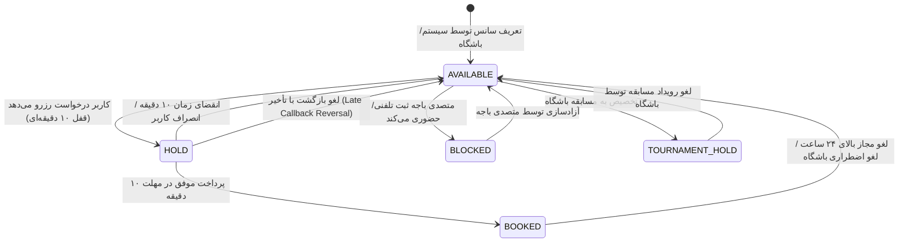
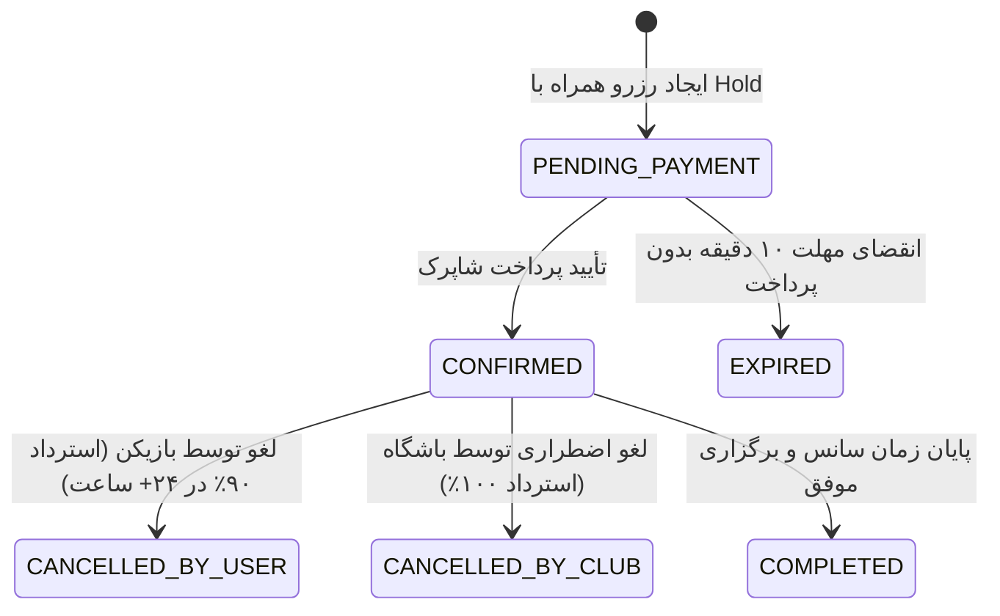

# Phase 1: Data Model & State Machines

**Feature**: `001-court-booking-engine`  
**Date**: 2026-09-22  
**Status**: Ready  

---

## 1. Entity Definitions & Schemas

### 1.1 User (کاربران سیستم)
کاربران شامل ورزشکاران (بازیکنان پدل و تنیس)، متصدیان باجه و مدیران باشگاه هستند.

| فیلد | نوع داده | محدودیت / نمایه | شرح |
| :--- | :--- | :--- | :--- |
| `id` | UUID / Int PK | Primary Key | شناسه یکتای کاربر |
| `phone_number` | VARCHAR(15) | Unique, Not Null | شماره موبایل با پیش‌شماره استاندارد (09...) |
| `full_name` | VARCHAR(100) | Nullable | نام و نام خانوادگی کاربر |
| `role` | VARCHAR(20) | Not Null, Default 'PLAYER' | نقش کاربر (`PLAYER`, `CLUB_OPERATOR`, `CLUB_ADMIN`) |
| `password_hash`| VARCHAR(255) | Nullable | هش رمز عبور (صرفاً برای کادر باشگاه) |
| `is_active` | BOOLEAN | Not Null, Default True | وضعیت فعال بودن حساب |
| `created_at` | TIMESTAMPTZ | Not Null, Default NOW() | زمان عضویت |

---

### 1.2 Club (باشگاه ورزشی)
اطلاعات مجموعه ورزشی و مشخصات قرارداد مالی با پلتفرم.

| فیلد | نوع داده | محدودیت / نمایه | شرح |
| :--- | :--- | :--- | :--- |
| `id` | UUID / Int PK | Primary Key | شناسه یکتای باشگاه |
| `name` | VARCHAR(150) | Not Null | نام تجاری باشگاه |
| `city` | VARCHAR(50) | Not Null | شهر (پیش‌فرض: تهران) |
| `address` | TEXT | Not Null | آدرس دقیق پستی و لوکیشن |
| `phone` | VARCHAR(20) | Not Null | تلفن ثابت یا پذیرش باشگاه |
| `commission_rate`| DECIMAL(5, 2) | Not Null, Default 3.00 | درصد کارمزد قراردادی پلتفرم (مثلاً ۳.۰۰٪) |
| `is_active` | BOOLEAN | Not Null, Default True | وضعیت پذیرش آنلاین |
| `created_at` | TIMESTAMPTZ | Not Null, Default NOW() | تاریخ ثبت |

---

### 1.3 Court (زمین ورزشی)
زمین‌های پدل یا تنیس متعلق به یک باشگاه ورزشی.

| فیلد | نوع داده | محدودیت / نمایه | شرح |
| :--- | :--- | :--- | :--- |
| `id` | UUID / Int PK | Primary Key | شناسه زمین |
| `club_id` | UUID / Int FK | Foreign Key -> Club.id | باشگاه مربوطه |
| `name` | VARCHAR(100) | Not Null | عنوان زمین (مثلاً کورت ۱، زمین شیشه‌ای سنترال) |
| `sport_type` | VARCHAR(20) | Not Null (`PADEL`, `TENNIS`)| نوع ورزش |
| `surface_type`| VARCHAR(50) | Nullable | نوع کفپوش (چمن مصنوعی موندو، هاردکورت، خاک) |
| `is_indoor` | BOOLEAN | Not Null, Default False | سرپوشیده بودن یا روباز بودن |
| `is_active` | BOOLEAN | Not Null, Default True | وضعیت سرویس‌دهی زمین |

---

### 1.4 TimeSlot (سانس زمانی زمین)
یک بازه زمانی مشخص برای یک زمین ورزشی در یک روز خاص.

| فیلد | نوع داده | محدودیت / نمایه | شرح |
| :--- | :--- | :--- | :--- |
| `id` | UUID / Int PK | Primary Key | شناسه سانس |
| `court_id` | UUID / Int FK | Foreign Key -> Court.id | زمین مربوطه |
| `slot_date` | DATE | Not Null, Index | تاریخ روز سانس |
| `start_time` | TIME | Not Null | ساعت شروع سانس (مثلاً ۱۸:۰۰) |
| `end_time` | TIME | Not Null | ساعت پایان سانس (مثلاً ۱۹:۳۰) |
| `price` | BIGINT | Not Null (به ریال/تومان) | قیمت مصوب باجه باشگاه |
| `status` | VARCHAR(20) | Not Null, Index | وضعیت جاری سانس |
| `hold_expires_at`| TIMESTAMPTZ | Nullable, Index | مهلت انقضای قفل ۱۰ دقیقه‌ای |
| `held_by_user_id`| UUID / Int FK | Nullable | کاربر دارنده قفل موقت جاری |

**محدودیت منحصربه‌فرد (Unique Constraint):**  
`UNIQUE(court_id, slot_date, start_time)` تضمین می‌کند در یک زمین هیچ دو سانسی در یک ساعت تعریف نشوند.

---

### 1.5 Booking (سفارش رزرو)
رکورد ثبت‌شده برای رزرو قطعی یا در حال پرداخت سانس.

| فیلد | نوع داده | محدودیت / نمایه | شرح |
| :--- | :--- | :--- | :--- |
| `id` | UUID / Int PK | Primary Key | شناسه یکتای رزرو |
| `tracking_code`| VARCHAR(30) | Unique, Index | کد رهگیری مشتری (برای نمایش و پیامک) |
| `user_id` | UUID / Int FK | Foreign Key -> User.id | کاربر رزروکننده |
| `timeslot_id` | UUID / Int FK | Foreign Key -> TimeSlot.id | سانس انتخاب‌شده |
| `amount_paid` | BIGINT | Not Null | کل مبلغ پرداختی بازیکن |
| `status` | VARCHAR(30) | Not Null, Index | وضعیت رزرو |
| `created_at` | TIMESTAMPTZ | Not Null, Default NOW() | زمان ثبت اولیه رزرو |
| `confirmed_at`| TIMESTAMPTZ | Nullable | زمان قطعی شدن رزرو پس از پرداخت |
| `cancelled_at`| TIMESTAMPTZ | Nullable | زمان لغو |

---

### 1.6 PaymentAttempt (تلاش پرداخت بانکی)
ثبت تراکنش و تلاش‌های ارسال به درگاه شاپرک با رعایت اصل قابلیت تکرارپذیری ایمن (Idempotency).

| فیلد | نوع داده | محدودیت / نمایه | شرح |
| :--- | :--- | :--- | :--- |
| `id` | UUID / Int PK | Primary Key | شناسه رکورد تلاش |
| `booking_id` | UUID / Int FK | Foreign Key -> Booking.id | رزرو مربوطه |
| `idempotency_key`| VARCHAR(64) | Unique, Not Null | کلید یکتایی تولیدشده توسط سرور |
| `gateway_name`| VARCHAR(30) | Not Null | نام درگاه (سامان کیش، به‌پرداخت، زرین‌پال و...) |
| `amount` | BIGINT | Not Null | مبلغ ارسالی به درگاه |
| `status` | VARCHAR(30) | Not Null | وضعیت پرداخت |
| `gateway_token`| VARCHAR(255)| Nullable | توکن/شناسه پرداخت صادرشده از درگاه |
| `ref_id` | VARCHAR(100)| Nullable, Index | شماره پیگیری بانکی شاپرک (RRN/RefId) |
| `created_at` | TIMESTAMPTZ | Not Null | زمان هدایت به درگاه |
| `verified_at`| TIMESTAMPTZ | Nullable | زمان تأیید بانکی |

---

### 1.7 Refund (استرداد وجه)
ثبت و ردیابی تراکنش‌های بازگشت وجه ناشی از لغو بازیکن، کنسلی اضطراری باشگاه یا بازگشت با تأخیر (Late Callback).

| فیلد | نوع داده | محدودیت / نمایه | شرح |
| :--- | :--- | :--- | :--- |
| `id` | UUID / Int PK | Primary Key | شناسه استرداد |
| `booking_id` | UUID / Int FK | Foreign Key -> Booking.id | رزرو لغوشده |
| `amount` | BIGINT | Not Null | مبلغ خالص مستردشونده به کاربر |
| `penalty_amount`| BIGINT | Not Null, Default 0 | مبلغ جریمه کسرشده (در کنسلی‌های بالای ۲۴ ساعت) |
| `reason` | VARCHAR(50) | Not Null | علت استرداد |
| `status` | VARCHAR(30) | Not Null | وضعیت (`PENDING`, `COMPLETED`, `FAILED`) |
| `reversal_ref_id`| VARCHAR(100)| Nullable | شناسه پیگیری Reversal درگاه بانکی |
| `created_at` | TIMESTAMPTZ | Not Null | زمان درخواست استرداد |
| `completed_at`| TIMESTAMPTZ | Nullable | زمان تکمیل بازگشت پول |

---

## 2. State Machine Transitions (ماشین وضعیت موجودیت‌ها)

### 2.1 TimeSlot State Machine

| وضعیت مبدأ | رویداد محرک (Trigger) | وضعیت مقصد | شرط و قواعد انتقال |
| :--- | :--- | :--- | :--- |
| `AVAILABLE` | `hold_slot(user_id)` | `HOLD` | اتمیک با `SELECT FOR UPDATE`؛ تنظیم `expires_at = now() + 10m` |
| `AVAILABLE` | `operator_block(operator_id)`| `BLOCKED` | صرفاً توسط متصدی احراز هویت شده همان باشگاه |
| `HOLD` | `payment_verified(ref_id)` | `BOOKED` | شرط اکید: `now < expires_at` و اعتبارسنجی درگاه |
| `HOLD` | `expire_cleanup()` | `AVAILABLE` | شرط: `now >= expires_at` و عدم ثبت پرداخت |
| `HOLD` | `late_callback_reversed()` | `AVAILABLE` | پرداخت بعد از انقضا رخ داده و فوراً Reverse شده است |
| `BLOCKED` | `operator_unblock(operator_id)`| `AVAILABLE` | توسط متصدی باجه |
| `BOOKED` | `cancel_booking(reason)` | `AVAILABLE` | لغو کاربر با فاصله ۲۴+ ساعت یا کنسلی اضطراری باشگاه |

---

### 2.2 Booking State Machine

---

### 2.3 PaymentAttempt State Machine

| وضعیت مبدأ | رویداد محرک | وضعیت مقصد | شرح عملیاتی |
| :--- | :--- | :--- | :--- |
| `[*]` | `initiate_payment()` | `INITIATED` | کاربر با دریافت توکن درگاه به صفحه بانک هدایت می‌شود. |
| `INITIATED` | `verify_callback_success()`| `SUCCESSFUL`| بانک تراکنش را تأیید کرده و زمان قبل از انقضای ۱۰ دقیقه بوده است. |
| `INITIATED` | `callback_failed_or_cancel()`| `FAILED` | کاربر در درگاه دکمه انصراف را زده یا پرداخت بانکی ناموفق بوده است. |
| `INITIATED` | `late_callback_reverse()` | `REVERSED` | پول در بانک کسر شده اما زمان قفل تمام شده بوده؛ بلافاصله Reversal شد. |
